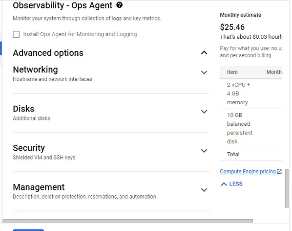
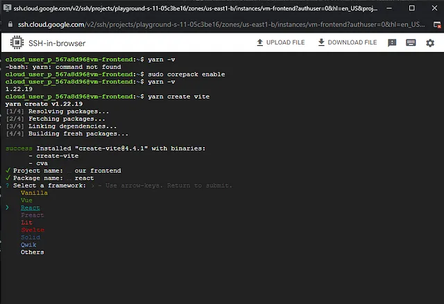
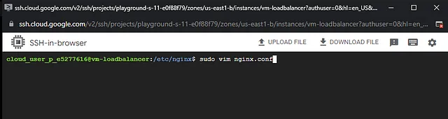
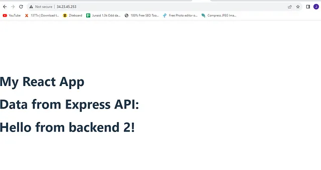

## Introduction:
In this hands on demo i will deploy a full stack applictaion consisting a frontend and a backend application within a virtual private cloud(VPC) on Google cloud platform(GCP). There will a virtual machine(VM) for the frontend application and two VM’s for the backend application. Additionally i will set up a front-facing load balancer that will serve as a reverse-proxy for the system and distribute traffic evenly between the two backend VM’s. Lastly, i will fetch data from the backend and display it on the frontend.

## What is VM?
VM stands for Virtual Machine. It is a software emulation of a physical computer that runs an operating system and applications as if it were a separate physical machine. Virtual machines are created by virtualization software that allows multiple virtual machines to run on a single physical host machine.

Popular virtualization solutions include VMware vSphere, Microsoft Hyper-V, Oracle VirtualBox, and open-source solutions like KVM (Kernel-based Virtual Machine) and Xen.

## What is VPC?
VPC stands for Virtual Private Cloud. It is a cloud computing concept and service offered by various cloud providers like Amazon Web Services (AWS), Microsoft Azure, Google Cloud Platform (GCP), and others. A VPC allows users to create a virtual network in the cloud, which simulates the functionalities of a traditional on-premises network within a cloud environment.

It’s important to note that the specifics of a VPC can vary depending on the cloud provider you use. For example, AWS’s VPC might have slightly different features and terminology compared to Azure’s VNet (Virtual Network) or GCP’s VPC. However, the underlying concept of creating a private virtual network within the cloud remains consistent across these providers.

## What is GCP?
GCP stands for Google Cloud Platform. It is a suite of cloud computing services and products offered by Google. GCP provides a wide range of cloud-based solutions that enable businesses and developers to build, deploy, and scale applications and services effectively. As with other major cloud providers like Amazon Web Services (AWS) and Microsoft Azure, GCP offers various services across multiple domains, including computing, storage, databases, machine learning, networking, and more.

## What is Nginx?
Nginx (pronounced “engine-x”) is a high-performance, open-source web server and reverse proxy server. Originally developed by Igor Sysoev in 2004, Nginx is now maintained and developed by Nginx, Inc. It is one of the most popular web servers in the world and is widely used for serving web content, handling application delivery, and acting as a reverse proxy for load balancing and caching.

Nginx is widely used by many high-traffic websites, web applications, and content delivery networks (CDNs) due to its efficiency, speed, and ability to handle heavy workloads. It is often deployed in combination with other technologies like PHP, Node.js, Ruby, and others to create powerful and scalable web architectures.

In addition to the open-source version, Nginx, Inc. offers commercial products and services, including Nginx Plus, which provides additional features and support for enterprise use cases.

## what is load balancer?
A load balancer is a crucial component in computer networking and web services architecture. It is designed to distribute incoming network traffic across multiple servers or resources to ensure efficient utilization of resources, optimize performance, and maintain high availability of applications and services. Load balancing is particularly important in scenarios where a single server or resource might become overwhelmed by incoming requests, leading to slow response times or service downtime.

Load balancers can operate at various layers of the networking stack, such as the application layer, transport layer, or network layer.

Load balancers can improve system performance, scalability, and fault tolerance by spreading the load across multiple servers. Additionally, they can detect when a server becomes unresponsive and stop sending traffic to it, thus enhancing the overall availability of services.

Modern load balancers often come with additional features such as health checks, SSL termination, session persistence, and content caching. These features contribute to the overall reliability, security, and performance optimization of web applications and services.

## Overview of the full diagram below:


## Prerequisite:
- You will need GCP account
- Knowledge about VM instance, Subnetting, Network interface.
## Step 1:
In this step we will create one VPC. First login into GCP. You will see dashboard like this


Now, go to vpc nerwork option from left side and click on vpc network.


Now click on create VPC Network(see the highlighted area).


Now we will create our vpc. Give a vpc name(give name as your wish).


Now scroll and go to the new subnet option, give a name for subnet(subnet-ja-1), select a region(us-east-1) and add ip range(i have given 10.10.0.0/24).


Now, go to firewall option and select all firewall option. Remember this is just a hands on demo project that’s why we have selected all firewall option, you will not try this in production project.


Now scroll down and click create button to create our fisrt vpc.


Now see the vpc network chart, our vpc(vpc-ja-1) is listed there.


## Step 2:
In this step we will create four vm under this vpc. One vm for frontend application and two vm for backend application and one vm for nginx load balancer server.

Go to left hand menu. From Compute Engine click on vm instance option.


Now click on create instance(see the highlighted area).


## 1st VM:
Now we will create our first vm. Give a name to vm(give name as your wish), select a region(as we are creating this vm under the created vpc and our vpc is in the us-east1 region, so we will select us-east1 region), select zone(this is availability zone, i have selected us-east1-b, you can choose your own), select machine configuration(i have choosen E2, as it is low configuration and low cost, it’s a just hand’s on demo, so we don’t need any high configuration).


We have to remember that our vm-frontend will not have any public ip. So, we should select external IPv4 address as none.


Now, scroll down below to Firewall option and choose Allow HTTP traffic and Allow HTTPS traffic both options.


Now go to Advance options, click on Networking option.




Now go to network interface option select network(we will select vpc-ja-1), select subnetwork(i have selected subnet-ja-1).


Now, scroll below and click on create button.


Our first vm is created. See the figure below.


Our 1st vm got the internel ip(private ip) of 10.10.0.2


## 2nd VM:
Now we will create our backend1 vm for backend application.

Now again click on create instance option.


Now we will create second vm. Give a name to vm(give name as your wish), select a region(as we are creating this vm under our vpc and our vpc is in the us-east1 region, so we will select us-east1 region), select zone(this is availability zone, i have selected us-east1-b, you can choose your own), select machine configuration(i have choosen E2, as it is low configuration and low cost, it’s a just hand’s on demo, so we don’t need any high configuration).


We have to remember that our vm-backend1 will not have any public ip. So, we should select external IPv4 address as none.


Now, scroll down below to Firewall option and choose Allow HTTP traffic and Allow HTTPS traffic both options.


Now go to Advance options, click on Networking option.


Now go to network interface option select network(we will select vpc-ja-1), select subnetwork(i have selected subnet-ja-1).


Now, scroll below and click on create button.


Our second vm(vm-backend2) is created. See the figure below.


Our 2nd vm got the internel ip(private ip) of 10.10.0.3 and does not have any public ip.


## 3rd VM:
Now we will create our backend2 vm for backend application.

Now again click on create instance option.


Now we will create third vm. Give a name to vm(give name as your wish), select a region(as we are creating this vm under our vpc and our vpc is in the us-east1 region, so we will select us-east1 region), select zone(this is availability zone, i have selected us-east1-b, you can choose your own), select machine configuration(i have choosen E2, as it is low configuration and low cost, it’s a just hand’s on demo, so we don’t need any high configuration).


[vm-backend2](img/31.png)

We have to remember that our vm-backend2 will not have any public ip. So, we should select external IPv4 address as none.


Now, scroll down below to Firewall option and choose Allow HTTP traffic and Allow HTTPS traffic both options.


Now go to Advance options, click on Networking option.


Now go to network interface option select network(we will select vpc-ja-1), select subnetwork(i have selected subnet-ja-1).


Now, scroll below and click on create button.


Our third vm(vm-backend2) is created. See the figure below.


## 4th VM:
Now we will create our load balancer vm for reverse proxy.

Now again click on create instance option.


Now we will create fourth vm. Give a name to vm(give name as your wish), select a region(as we are creating this vm under our vpc and our vpc is in the us-east1 region, so we will select us-east1 region), select zone(this is availability zone, i have selected us-east1-b, you can choose your own), select machine configuration(i have choosen E2, as it is low configuration and low cost, it’s a just hand’s on demo, so we don’t need any high configuration).


We have to remember that only our vm-loadbalancer will have public ip. So, we should select external IPv4 address as ephimeral.


Now, scroll down below to Firewall option and choose Allow HTTP traffic and Allow HTTPS traffic both options.


Now go to Advance options, click on Networking option.


Now go to network interface option select network(we will select vpc-ja-1), select subnetwork(i have selected subnet-ja-1).


Now, scroll below and click on create button.


Our fourth vm(vm-loadbalancer) is created. See the figure below.


## Step 3:
In this step we will install nginx in vm-loadbalancer(4th-vm) and also install a react application in our vm-frontend(1st-vm). Then we will try to connect load balancer vm with front end vm.

## Installing Nginx in vm-loadbalancer:
Open ssh terminal of vm-loadbalancer


Authorize to open terminal.


now type this command in ssh shell

```ruby
sudo apt update -y
```


It will update our applications. Now type this command.

```ruby
sudo apt install nginx -y
```


Now copy the external ip of vm-loadbalancer and paste it in the browser url section and type enter button.


You will see the welcome page from nginx server.


So, we have successfully installed nginx.

## Installing React app in vm-frontend:
Open the vm-frontend ssh terminal.


Click on authorize.


Now in terminal type

```ruby
sudo apt update -y
```

It will show an error


Because the vm-frontend does not have a public ip to connect outside vpc.

So, for this we need to create a NAT Gateway for this three vm(vm-frontend, vm-backend1, vm-backend2). All the three vm will install any software through this NAT Gateway. Remember that our vm-loadbalancer will not connect through NAT Gateway, because it has already bind with a public ip.

Now search cloud nat in search bar and click on it.


Click on Create cloud nat gateway to create nat gateway.


Give a a name for nat gateway. Remember, to create nat gateway we need to create cloud router. Select cloud router network(vpc-ja-1), region(us-east1). Click on Create router.


Click on create new router


[create new router](img/60.png)

Give a name(router-ja). Click on create button.


Router has been created.


Now, click on create button.


See the figure. Our cloud NAT is showing in the table.


Now open vm-frontend ssh terminal again. Type this again

```ruby
sudo apt update -y
```

Now it will update.


Type this to become super user.

```ruby
sudo su
```


Now we will have to install node js. Because to run a react application node js will be required. Type this command

```ruby
curl -fsSL https://deb.nodesource.com/setup_18.x | bash - &&\
apt-get install -y nodejs
```


Type exit to logout from super user.


We will check if node js is installed or not. Type this command

```ruby
node -v
```

Node js is installed successfully.


Now we will check if yarn package manager is installed or not. Type this command

```ruby
yarn -v
```

It’s showing yarn is not installed.


Actually yarn is installed but it’s not showing. We just have to enable corepack. Type this command.

```ruby
sudo corepack enable
```


Now again type this command.

```ruby
yarn -v
```

Now, yarn is showing version.


Now we will create our react app using yarn package manager. Type this command.

```ruby
yarn create vite
```


Give a project name(i have given our-frontend) and click on enter button. Now choose react by using arrow key and type enter button.




Now choose typescript+swc and click enter button.


One react app has been created in a folder. This folder name is our-frontend(this is the react app name). Now go to this folder. Type this

```ruby
cd our-frontend
```

type ls in terminal and press enter button.


we don’t have any node modules in our-frontend folder. To run a react app node modules libraries and packages are required. To install node modelues packages type yarn in terminal and press enter button.


type ls in terminal, you will see node_modules folder.


Now type this command to build our react app.

```ruby
yarn run build
```


so our react application has been built.

## Step 4:
In this step we will connect our vm-frontend from our vm-loadbalancer.

First open vm-frontend ssh terminal and go to already installed react app folder. Type this command

```ruby
cd our-frontend
```

now we are in react app folder. Now type this command.

```ruby
sudo yarn preview --host --port 80
```

It will open port 80 to listen any server.


Now open ssh terminal of vm-loadbalancer and type this command.

```ruby
sudo apt install -y telnet net-tools
```


Now, type this command

```ruby
curl 10.10.0.2
```

Remember 10.10.0.2 is the private ip of vm-frontend. This is showing the html format of react app in the terminal.


So we have successfully connected vm-frontend from vm-loadbalancer.

## Step 5:
In this step we will try to configure vm-loadbalancer such that when we will enter the vm-loadbalancer public ip(34.23.154.227) in the browser, it will show the vm-frontend(it will show the react app).

First go to /etc/nginx folder. Type this command

```ruby
cd /etc/nginx
```


Now we have to open the nginx.conf file using vim editor


Type this command

```ruby
sudo vim nginx.conf
```


Now delete all the code in editor.


Copy and paste this code in the editor. Then save and quit from vim editor.

```ruby
events {
    # empty placeholder
}


http {

    server {
        listen 80;

        location / {
            proxy_pass http://frontend;
        }

    }

    upstream frontend {
        server 10.10.0.2:80;
    }
}
```

In this configuration we are trying to bypass vm-frontend via vm-loadbalancer.


Now save and quit


reload server to change the config file


Now enter the vm-loadbalancer public ip(34.23.154.227, please see the figure , the ip is different because i have tried several times creating this vm, so it changes, you just insert your vm public ip) in the browser


So successfully we have connected our frontend with load balancer.


## Step 6:
In this step we will install express server in our two backend vm.

### Installing Express in vm-backend1:
open the ssh terminal of vm-backend1 and type this command

```ruby
sudo apt update -y
```


Now we will install node js in our vm-backend1, type this command

```ruby
sudo su

curl -fsSL https://deb.nodesource.com/setup_18.x | bash - &&\
apt-get install -y nodejs
```


now exit from super user.


make a folder be1 and go to this folder

```ruby
mkdir be1
cd be1
```


enable corepack and type this command

```ruby
sudo corepack enable
npm init -y
```


now install express, type this command

```ruby
yarn add express
```


now create a index.js file using vim editor, type this command

```ruby
vim index.js
```


copy and paste this code in the index.js file

```ruby
const express = require('express');

// Create an instance of the Express application
const app = express();

// Define a route for the root URL
app.get('/', (req, res) => {
  res.send('Hello from backend 1!');
});

// Start the server and listen on a specific port
const PORT = 80;
app.listen(PORT, () => {
  console.log(`Server is running on port ${PORT}`);
});
```

now save and quit from vim editor


type this command to run index.js file

```ruby
sudo node index.js
```


Now we will check from vm-backend2 if our vm-backend1 is running or not. Open ssh terminal of vm-backend2 and type this command

```ruby
curl 10.10.0.3
```


it’s showing hello from backend1.

## Installing Express in vm-backend2:
open the ssh terminal of vm-backend2 and type this command

```ruby
sudo apt update -y
```


now we will install node js in our vm-backend2, type this command

```ruby
sudo su

curl -fsSL https://deb.nodesource.com/setup_18.x | bash - &&\
apt-get install -y nodejs
```


make a folder be2 and go to this folder and enable corepack

```ruby
mkdir be2
cd be2
sudo corepack enable 
```


now type this command

```ruby
npm init -y
```


install express using yarn

```ruby
yarn add express
```


create a index.js file using vm editor

```ruby
vim index.js
```


copy and paste this code in index.js file

```ruby
const express = require('express');

// Create an instance of the Express application
const app = express();

// Define a route for the root URL
app.get('/', (req, res) => {
  res.send('Hello from backend 2!');
});

// Start the server and listen on a specific port
const PORT = 80;
app.listen(PORT, () => {
  console.log(`Server is running on port ${PORT}`);
});
```

save and quit from vim editor


now run index.js file

```ruby
sudo node index.js
```


now we will check from vm-backend1 if vm-backend2 is running or not

type this command

```ruby
curl 10.10.0.4
```

here 10.10.0.4 is the private ip of vm-backend2


it’s showing “Hello from backend 2"

## Step 7:
In this step we will configure load balancer in such that we can excess backend 1 and backend 2 from our load balancer.

First run the two backend server


Now open load balancer terminal and go to etc/nginx folder. Type this command

```ruby
cd /etc/nginx
```

now open nginx.conf file

```ruby
sudo vim nginx.conf
```



copy and paste this code in node.conf file

```ruby
events {
    # empty placeholder
}


http {

    server {
        listen 80;

        location / {
            proxy_pass http://frontend;
        }
        location /api/ {
            rewrite ^/api/(.*)$ /$1 break;
            proxy_pass http://backend;
        }
    }

    upstream frontend {
        server 10.10.0.2:80;
    }
    upstream backend{
        server 10.10.0.3;
        server 10.10.0.4;
    }
}
```

We are adding private ip of backend 1 and backend 2 in nginx.conf file


now save and quit from vim editor and reload the nginx server to save the change of nginx.conf file

```ruby
sudo nginx -s reload
```


now go to browser and type

```ruby
34.23.45.253/api
```


It’s showing backend 1. Now again reload the browser


It’s showing from backend 2. So, nginx server is equally distributing traffic between the backend server.

## Step 8:
In this step we will connect the two backend express server with our front end react app through vm-loadbalancer.

Open ssh terminal of vm-frontend and go to our-frontend folder. Then open the package.json file using vm editor. Type this command

```ruby
cd our-frontend

vim package.json
```


Now add this line in package.json file

```ruby
"proxy": "34.23.45.253/api"
```

See the line number 12. Here 34.23.45.253 is the public ip of load balancer


save and quit package.json file. Now go to src folder and install axios

and add a file ApiComponent.tsx using vim editor

```ruby
cd src

yarn add axios

vim ApiComponent.tsx
```


copy and paste this code in ApiComponent.tsx file

```ruby
import { useState, useEffect } from 'react';
import axios from 'axios';

function ApiComponent() {
  const [data, setData] = useState([]);

  useEffect(() => {
    // Make a GET request to your Express API endpoint
    axios.get('http://34.23.45.253/api/') // Change '/api/data' to your actual API endpoint
      .then(response => {
        setData(response.data);
      })
      .catch(error => {
        console.error('Error fetching data:', error);
      });
  }, []);

  return (
    <div>
      <h1>Data from Express API:</h1>
      <h1>{data}</h1>
    </div>
  );
}

export default ApiComponent;
```

In this code we are calling load balancer using axios. now save and quit from vim editor


Now open the App.tsx file

```ruby
vim App.tsx
```

Copy and paste this code

```ruby
import ApiComponent from './ApiComponent';

function App() {
  return (
    <div>
      <h1>My React App</h1>
      <ApiComponent />
    </div>
  );
}

export default App;
```

Save and quit this file


Now run and build again to save the changes

```ruby
yarn run build
```


now go to src folder

```ruby
cd src
```


Type this command

```ruby
sudo yarn preview --host --port 80
```


Now open browser and enter the public ip of load balancer


It’s showing Hello from backend 1. Reload this page again



It’s showing Hello from backend 2.

Finally we have done our project successfully.


